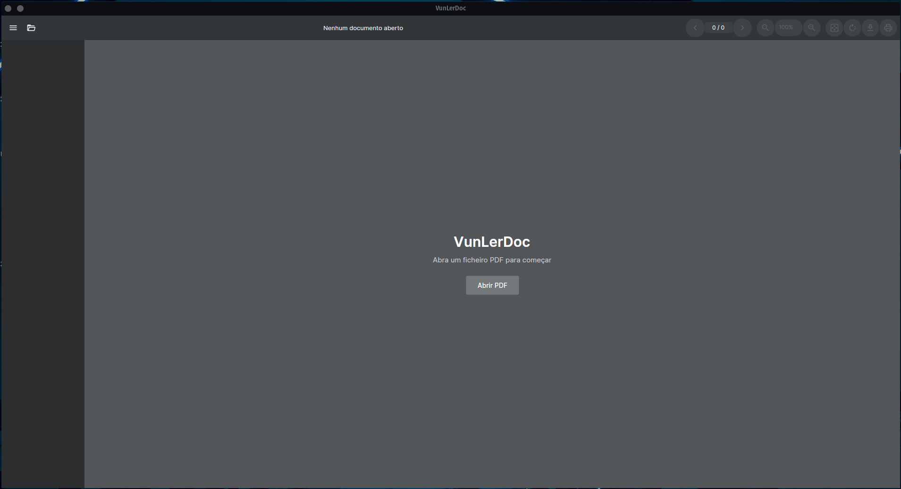
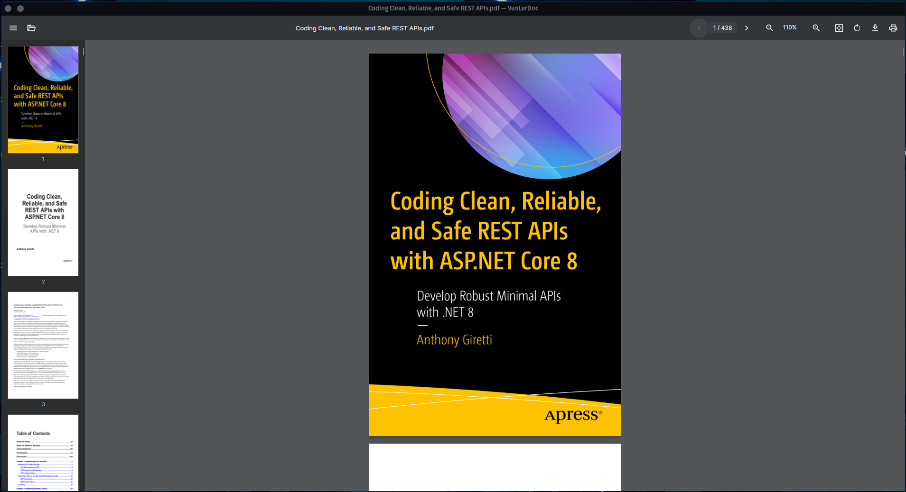
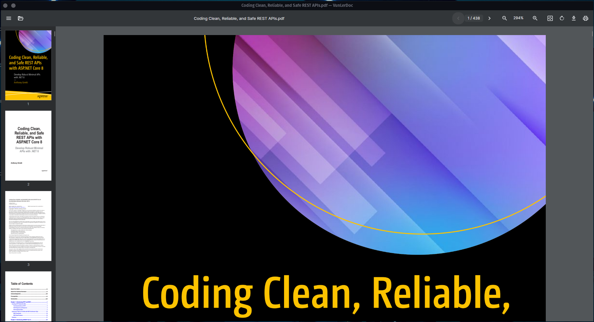
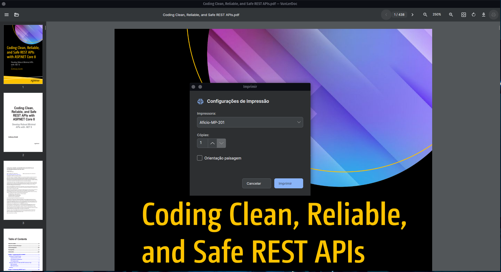

<p align="center">
  
</p>

<h1 align="center">VunLerDoc 📄</h1>

<p align="center">
  <b>A fast, native, dependency-free PDF reader for the desktop.</b><br/>
  Open a document. Scroll smoothly through hundreds of pages. Print it. Done.
</p>

<p align="center">
  <a href="https://github.com/ram-ismael/VunLerDoc/stargazers"></a>
  <a href="https://github.com/ram-ismael/VunLerDoc/network/members"></a>
  <a href="https://github.com/ram-ismael/VunLerDoc/releases"></a>
  
  
  
</p>

<p align="center">
  <a href="#-screenshots">Screenshots</a> ·
  <a href="#-download--run">Download</a> ·
  <a href="#-features">Features</a> ·
  <a href="#-tech-stack">Tech Stack</a> ·
  <a href="#-building-from-source-developers">Build</a> ·
  <a href="#-project-structure">Structure</a>
</p>

---

Most PDF readers are either a browser tab away from your data, or a bloated installer full of things you didn't ask for. **VunLerDoc** is neither: a small, native, 100% offline desktop app with an Avalonia desktop interface and PDFium rendering — no embedded browser/CEF PDF viewer. It opens page 1 at full quality first, keeps the document usable immediately, and progressively prepares the remaining pages in the background.

If you find it useful, drop a ⭐ on the repo — it really helps the project grow!

---

## 📸 Screenshots

<p align="center">
  
  
</p>
<p align="center">
  
  
</p>
<p align="center">
  
</p>

---

## 🚀 Download & Run

Head to the `publish/` folder, grab the zip for your OS, extract it, and launch the app. You'll find them in the repository or in the [Releases](https://github.com/ram-ismael/VunLerDoc/releases) page — **no .NET runtime installation required**, everything needed to run is packed into the executable.

* **🪟 Windows (`win-x64`)**
  * Download and extract `publish/win-x64.zip`.
  * Double-click `VunLerDoc.exe` to run it immediately.

* **🐧 Linux (`linux-x64`)**
  * Download and extract `publish/linux-x64.zip`.
  * Grant execute permission (if needed) and run:
    ```bash
    chmod +x VunLerDoc
    ./VunLerDoc
    ```

On first launch, VunLerDoc registers itself in your OS's "Open with" menu for `.pdf` files — no admin rights needed on either platform.

---

## ✨ Features

| | |
|---|---|
| ⚡ **Progressive native loading** | Page 1 is prepared first and shown quickly; remaining pages are prepared once in a low-priority background queue while the reader stays fully usable. |
| 🔍 **Instant cached zoom (25%–400%)** | Each page gets one high-resolution 480-DPI master raster. Zoom changes only the native Avalonia layout/scaling — no PDF reload and no repeat PDFium render. |
| 🖱️ **Ctrl + mouse wheel zoom** | Ctrl + wheel up/down zooms in/out even with the pointer over the page; plain wheel keeps scrolling vertically. |
| 🧭 **Fit width / Fit page** | Instantly frame the document to the window without re-rendering prepared pages. |
| 🔗 **Native PDF links** | Click external URLs and internal PDF destinations, including hyperlinks generated by automatic tables of contents/indexes. Plain-text web URLs are detected too. |
| 🔄 **Instant page rotation** | Rotate the view in 90° increments using the already-cached page image; rotation does not re-render the PDF. |
| 🖼️ **Progressive thumbnail sidebar** | Thumbnails fill in as pages are prepared, with lightweight native placeholders instead of a blocked loading screen. |
| 🖱️ **Drag & drop** | Drop a PDF straight onto the window to open it. |
| 🖨️ **Native printing** | GDI+ at 300 DPI on Windows; on Linux the original PDF is handed directly to CUPS (`lp`) for full-fidelity printing. |
| 🔌 **OS integration** | Registers as an "Open with" option for PDF files — Windows registry on Windows, a per-user `.desktop` entry on Linux. |
| 📦 **Self-contained builds** | Single-file, self-contained executables — nothing to install. |

---

## 🛠️ Tech Stack

* **Language**: C# / .NET 10
* **Architecture**: MVVM, via CommunityToolkit.Mvvm
* **Desktop UI**: Avalonia (native desktop window/control surface; no WebView/CEF PDF UI)
* **PDF rendering**: [PDFium](https://pdfium.googlesource.com/pdfium/) (Google's PDF engine), via the PDFiumZ NuGet package
* **Imaging**: SkiaSharp

---

## 📁 Project Structure

```text
VunLerDoc/
├── Assets/               # App icon (logo.ico) and other visual resources
├── Converters/           # XAML value converters (bitmap, boolean, string)
├── Services/             # PDF rendering, printing and OS-integration services
│   ├── IPdfDocumentService.cs / PdfiumDocumentService.cs
│   ├── IPdfPrintService.cs / WindowsPdfPrintService.cs / LinuxPdfPrintService.cs
│   └── IFileAssociationService.cs / WindowsFileAssociationService.cs / LinuxFileAssociationService.cs
├── ViewModels/           # MainWindowViewModel, PdfPageItemViewModel
├── Views/                # MainWindow.axaml (UI)
├── Scripts/              # publish-windows.sh, publish-linux.sh
├── publish/              # Generated self-contained build zips (win-x64.zip, linux-x64.zip)
├── Program.cs
├── App.axaml
└── VunLerDoc.csproj
```

---

## 💻 Building from Source (Developers)

Requires the **.NET 10 SDK**.

1. Clone the repository:
   ```bash
   git clone https://github.com/ram-ismael/VunLerDoc.git
   cd VunLerDoc
   ```

2. Restore dependencies and build:
   ```bash
   dotnet restore
   dotnet build
   ```

3. Run the app:
   ```bash
   dotnet run --project VunLerDoc.csproj
   ```

4. To publish a new self-contained, single-file build:
   ```bash
   # Windows x64
   ./Scripts/publish-windows.sh

   # Linux x64
   ./Scripts/publish-linux.sh
   ```
   Each script drops a ready-to-share zip into `publish/` (`win-x64.zip` / `linux-x64.zip`).

---

## 🤝 Contributing

VunLerDoc is currently developed and maintained solo, but issues, suggestions and pull requests are very welcome:

1. Fork the project
2. Create a branch (`git checkout -b feature/my-feature`)
3. Commit your changes (`git commit -m 'feat: my new feature'`)
4. Push to the branch (`git push origin feature/my-feature`)
5. Open a Pull Request

---

## 🙏 Acknowledgements

* [PDFium](https://pdfium.googlesource.com/pdfium/) — the rendering engine at the core of VunLerDoc, via the [PDFiumZ](https://www.nuget.org/packages/PDFiumZ) NuGet package.
* [Avalonia UI](https://avaloniaui.net/) — the cross-platform UI framework this app is built on.

---

## 📄 License

This project is licensed under **MIT**. See the [LICENSE](LICENSE) file for details.

---

<p align="center">Designed and developed with ❤️ by <a href="https://github.com/ram-ismael">Ramadan Ismael</a>.</p>
